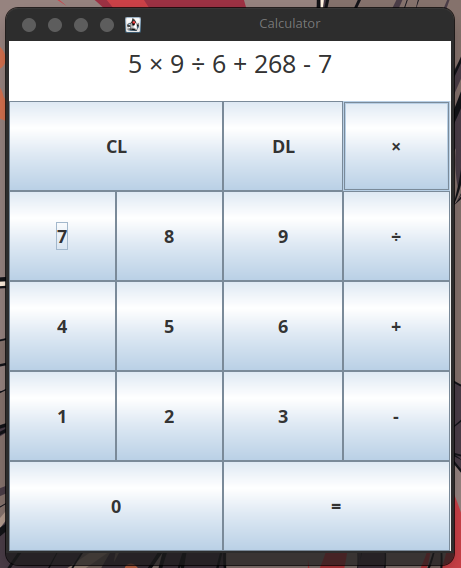

# Calculator
This repository contains the source code of Calculator, a simple GUI calculator written in Java using the Swing package that you can use to perform the most basic math operations with integer values: addition, subtraction, multiplication and division.

Here is a preview that you can check it out:



## Installation
### Using Releases
If you just want to use this software, using its releases is the way to go. In this section, you will learn how to do it.

#### Dependencies
In order to run a release, the following dependencies must be installed:

- JRE (Java Runtime Environment): it will be used to execute the program.

#### Procedures
Follow these steps:

- Access its [latest release page](https://github.com/skippyr/calculator/releases/latest).
- Click on the `Calculator.jar` file to download it.
- Open your downloads directory using a file manager.
- Execute the `Calculator.jar` file by clicking on it.

### Building From Source
If you are a developer and plan to make changes in the source code, building it from source is the way to go. In this section, you will learn how to do it.

#### Dependencies
In order to build it, the following dependencies must be installed:

- Git: it will be used to clone this repository.
- JDK (Java Development Kit) and Node.JS: they will be used to compile the source code.

#### Procedures
Using a terminal emulator, follow these steps:

- Clone this repository using `git`.

```bash
git clone --depth 1 https://github.com/skippyr/calculator
```

- Access the repository's directory.

```bash
cd calculator
  ```

- Execute the `build.js` script using Node.JS.

> [!IMPORTANT]
> If you are using Windows, before executing it you must ensure that both `java` and `jar` binaries from JDK are in your system's `PATH` environment variable, otherwise they won't be found and the build will fail.

```bash
node build.js
```

After running it successfully, it will create the `out` directory, which contains all the files related to the compilation: the `out/build` directory will contain all the Java classes compiled and the `out/releases` will contain all the Jar files created.

- Execute the `out/releases/Calculator.jar` using Java.

```bash
java -jar out/releases/Calculator.jar
```

> [!NOTE]
> If you will build this project more than once, you can also use the `--run` option as an argument to the build script. That way, it will automatically run the Jar file once it has been compiled.

```bash
node build.js --run
```

## Issues And Contributions
You can use its [issues page](https://github.com/skippyr/river-dreams/issues) to provide your feedback, to report any issue you are facing or to ask for help.

You can also fork it and send pull requests to be reviewed.

All kinds of contributions, from people of any skill level, is always appreciated.

## Copyright
This software is under the BSD-3-Clause license. A copy of the license is bundled with the source code.
